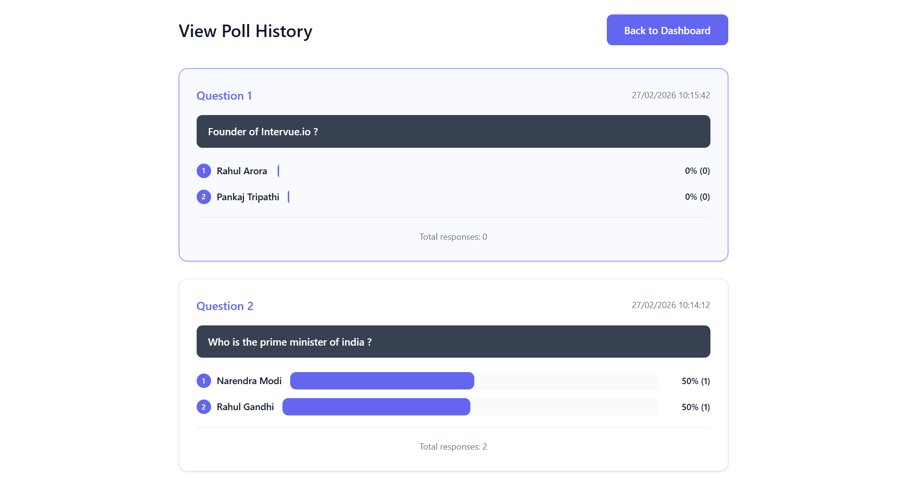
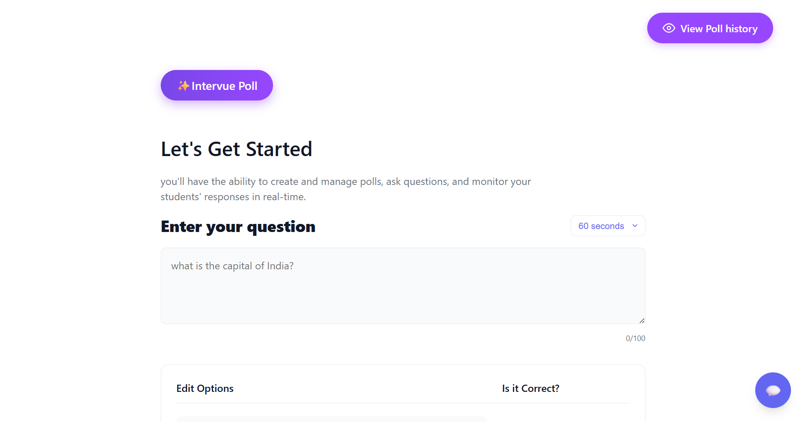
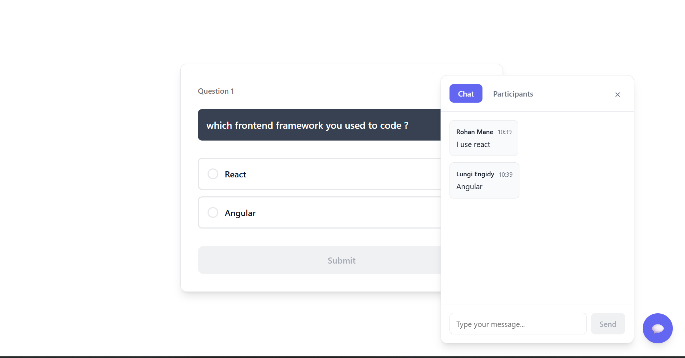
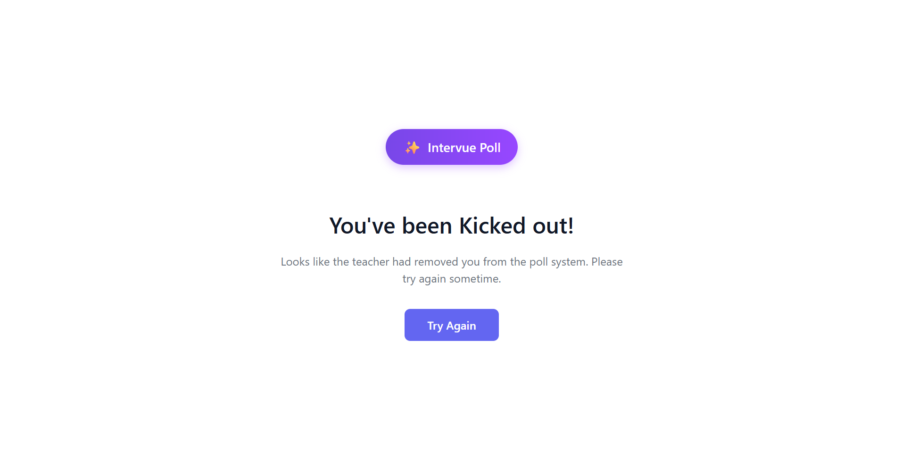
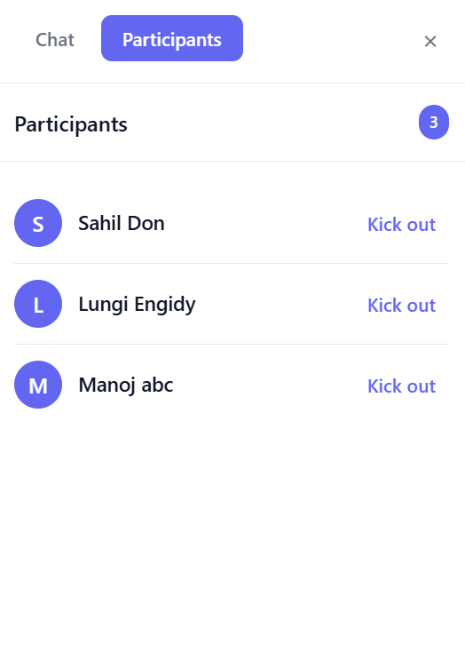

# Live Polling System

Real-time polling for classrooms. Teachers create polls, students answer live, and everyone sees results update instantly.








## Features
- Teacher controls: create polls, set timers, view live results
- Student flow: join with a name, answer within time limit, see results
- Live chat between teacher and students
- Real-time updates via WebSockets

## Tech Stack
- Frontend: React + Vite + Socket.io Client
- Backend: Node.js + Express + Socket.io
- Database: MongoDB

## Project Structure
```
backend/    Express API + Socket.io server
frontend/   React client
```

## Local Setup
### Prerequisites
- Node.js 18+ (recommended)
- npm
- MongoDB (local or hosted)

### Backend
```bash
cd backend
npm install
```

Create `backend/.env`:
```
PORT=5000
NODE_ENV=development
MONGODB_URI=mongodb://localhost:27017/live-poll
CLIENT_URL=http://localhost:5173
ALLOWED_ORIGINS=http://localhost:5173
```

Run the server:
```bash
npm start
```

### Frontend
```bash
cd frontend
npm install
```

Create `frontend/.env`:
```
VITE_API_URL=http://localhost:5000/api
VITE_SOCKET_URL=http://localhost:5000
```

Run the client:
```bash
npm run dev
```

Open:
- Frontend: `http://localhost:5173`
- Backend: `http://localhost:5000`

## Deployment
### Backend (Render)
- Root: `backend`
- Build: `npm install`
- Start: `npm start`
- Env vars: `NODE_ENV`, `MONGODB_URI`, `CLIENT_URL`, `ALLOWED_ORIGINS`

### Frontend (Vercel)
- Root: `frontend`
- Build: `npm run build`
- Output: `dist`
- Env vars: `VITE_API_URL`, `VITE_SOCKET_URL`

## Notes
- WebSockets require a server (Render, not a static host).
- For production, set `CLIENT_URL` and `ALLOWED_ORIGINS` to your frontend URL.
